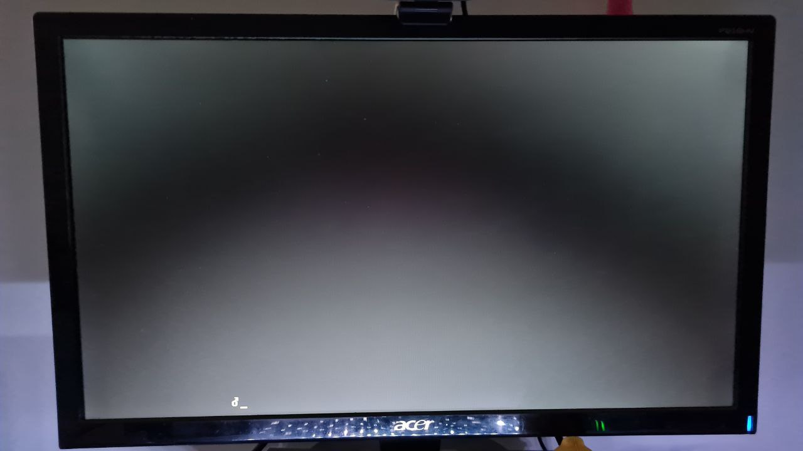
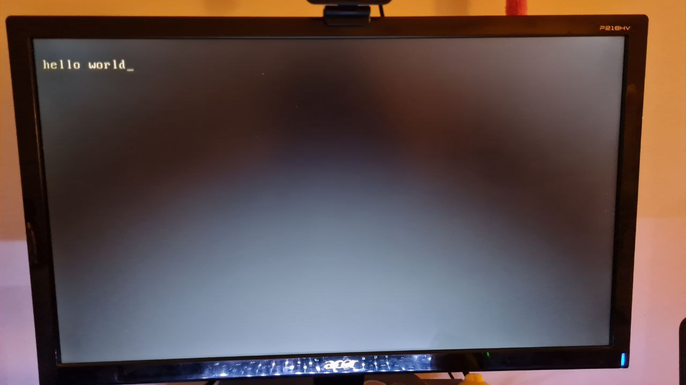

# Tp3-Sistemas de computacion
## UEFI y coreboot
### ¿Qué es UEFI? ¿cómo puedo usarlo? Mencionar además una función a la que podría llamar usando esa dinámica.

Las siglas **UEFI** vienen de Unified *Extensible Firmware Interface*. Esta interfaz especial es, por así decirlo, como un sistema operativo en miniatura que se encarga de arrancar la mainboard o placa base del ordenador y los componentes de hardware relacionados con ella.
*UEFI* suele considerarse un sucesor directo de *BIOS*. Sin embargo, la especificación UEFI no establece cómo programar un firmware totalmente, sino que se limita a describir la interfaz entre el firmware y el sistema operativo. Por este motivo, la especificación UEFI no sustituye realmente el sistema tradicional de entrada y salida, es decir, el *Basic Input/Output System* (BIOS), qué es la base del bootfirmware de un ordenador.

Dependiendo el equipo, la forma de acceder va a variar.

Las funciones que brindan van desde hacer Recoverys, Diagnosticos de sistema, elegir dispositivos de booteo y el modo.

> Referencia: [UEFI: interfaz de alto rendimiento para iniciar tu ordenador](https://www.ionos.es/digitalguide/servidores/know-how/uefi-unified-extensible-firmware-interface/)

### ¿Menciona casos de bugs de UEFI que puedan ser explotados?

Los casos mas nombrados, no se si son bugs de UEFI como tal pero si la afectan, se trata del error *CVE-2017-5703*, el cual afecta la funcion de *SPI* de intel. Esto permite al atacante borrar UEFI (o BIOS) del sistema editando el fragmento de memoria que se corresponde con este código.

> Referencia: [Bug en Intel SPI permite alterar la BIOS/UEFI](https://blog.segu-info.com.ar/2018/04/bug-en-intel-spi-permite-alterar-la.html)


### ¿Qué es Converged Security and Management Engine (CSME), the Intel
Management Engine BIOS Extension (Intel MEBx).?

Su función principal a grosso modo es el proporcionar un entorno de ejecución aislado y protegido desde el host a modo de software que se ejecuta directamente en la CPU mediante un firmware que para esta última es totalmente transparente.

*CSME* tiene tres roles principales que se definen varias características del sistema:

- Chasis
  - Arranque seguro de la plataforma
  - Overclocking
  - Carga del microcódigo en los motores PCH y CPU HW
- seguridad
  - Ejecución aislada y confiable de los servicios de seguridad (TPM, DRM y DAL)
- Manejabilidad
  - Gestión de la plataforma en una red fuera de banda (AMT)

*Intel MEBx* se trata del predecesor de de *CSME*, este fue cambiado en 2017 a raíz de numerosos problemas de seguridad, los cuales, requieren la frabriación del anteriormente nombrado sucesor.

> Referencia: [Intel CSME pc](https://hardzone.es/reportajes/que-es/intel-csme-pc/)
### ¿Qué es coreboot ? ¿Qué productos lo incorporan ?¿Cuales son las ventajas de su utilización?
A lo largo de los años, ha habido una tendencia a mover todos los elementos de la computadora a software libre, esta es la iniciativa de Coreboot.
Más que técnica, su creación responde a una necesidad ética como lo es el hecho de buscar que el software sea libre para todas las personas, y BIOS es el único que ha quedado olvidado, posee el apoyo de diversas empresas y corporaciones, entre ellos, la FSF, AMD, también fabricantes coom Gigabyte, MSI y además es patrocinado por Google, ni mas ni menos.

La ventaja de utilizarlo es que es posible cargar casi cualquier sistema operativo, y tiene la caracteristica de ser tremendamente eficiente, ya que luego de 16 comandos, el equipo ya entra en modo de 32 bits, haciéndolo aún más rápido.

> Referencia:  [Coreboot](https://es.wikipedia.org/wiki/Coreboot)


---

## Desafío: Linker
### ¿Que es un linker? ¿que hace?
A grandes rasgos, el linker es el programa encargado de tomar todos los archivos *objeto* (.o) generados por el **compilador**, con todo el código provisto por las bibliotecas, además remueve recursos inutilizados y por último combina los restantes para crear un *ejecutable* o incluso una nueva *library*. Hay enlaces que se pueden hacer de manera dinámica ya que sus bibliotecas lo requieren.

La mayoría de las veces se utilizan diversos archivos a la hora de crear un programa. Esto es lo mismo que decir que un programa de ordenador está compuesto por diferentes **módulos**. Cada uno de estos módulos se compila de forma independiente y dispone de una referencia simbólica. Así pues, una vez compilados, el linker podrá crear un "único" archivo, unificando todos los archivos objeto gracias a sus referencias simbólicas.

> Referencia: [¿Que es un linker?](https://ia-notes.com/2021/05/24/que-es-el-linker/)

### ¿Que es la dirección que aparece en el script del linker?¿Porqué es necesaria? 
La dirección que aparece en el script del linker es la 0x7C00, y es la dirección en la cual la BIOS carga el MBR, por lo que tanto desarrolladores de sistemas operativos o bootloaders asumen que su código en assembler es cargado y comienza desde dicha dirección.
Esa dirección es necesaria ya que nos dirá desde dónde podemos encontrar las primeras cosas cargables.
Los motivos por los cuales se decidió esa posición en su momento fueron:
1. Querían dejar el mayor espacio posible para que el sistema operativo se cargara dentro de los 32 KiB.
2. 8086/8088 usó 0x0 - 0x3FF para el vector de interrupciones, y el área de datos del BIOS fue posterior a esa decisión.
3. El sector de arranque era de 512 bytes, y el área de pila/datos para el programa de arranque necesitaba más 512 bytes.
4. Entonces, 0x7C00, se eligió el último 1024B de 32KiB.  

> Referencia: [The mysteries arround "0x7C00" in x86 architecture bios bootloader](https://www.glamenv-septzen.net/en/view/6)
 
> Referencia: [What memory is impacted using the location counter in linker script?](https://stackoverflow.com/questions/59881880/what-memory-is-impacted-using-the-location-counter-in-linker-script)

### Compare la salida de objdump con hd, verifique donde fue colocado el programa dentro de la imagen.
```
❯ objdump -s main.o

main.o:     formato del fichero elf64-x86-64

Contenido de la sección .text:
 0000 be0000b4 0eac08c0 7404cd10 ebf7f468  ........t......h
 0010 656c6c6f 20776f72 6c6400             ello world.     
Contenido de la sección .note.gnu.property:
 0000 04000000 20000000 05000000 474e5500  .... .......GNU.
 0010 020001c0 04000000 00000000 00000000  ................
 0020 010001c0 04000000 01000000 00000000  ................
Contenido de la sección .debug_line:
 0000 3b000000 03001d00 00000101 fb0e0d00  ;...............
 0010 01010101 00000001 00000100 6d61696e  ............main
 0020 2e530000 00000000 09020000 00000000  .S..............
 0030 0000133d 30212f2f 2f30020d 000101    ...=0!///0..... 
Contenido de la sección .debug_info:
 0000 2a000000 02000000 00000801 00000000  *...............
 0010 00000000 00000000 00000000 00000000  ................
 0020 00000000 00000000 00000000 0180      ..............  
Contenido de la sección .debug_abbrev:
 0000 01110010 06110112 01030e1b 0e250e13  .............%..
 0010 05000000                             ....            
Contenido de la sección .debug_aranges:
 0000 01000000 00000000 30000000 00000000  ........0.......
 0010 10000000 00000000 789cd361 60606062  ........x..a```b
 0020 00010e06 6420cd80 1d00000c 800052    ....d ........R 
Contenido de la sección .debug_str:
 0000 6d61696e 2e53002f 686f6d65 2f667261  main.S./home/fra
 0010 6e63696f 2f446f63 756d656e 746f732f  ncio/Documentos/
 0020 43756174 72695f31 2f536973 74656d61  Cuatri_1/Sistema
 0030 735f4465 5f436f6d 70757461 63696f6e  s_De_Computacion
 0040 2f547073 2f547033 2f526570 6f5f7072  /Tps/Tp3/Repo_pr
 0050 6f66652f 30314865 6c6c6f57 6f726c64  ofe/01HelloWorld
 0060 00474e55 20415320 322e3338 00        .GNU AS 2.38.   

❯ hexdump -C main.img
00000000  be 0f 7c b4 0e ac 08 c0  74 04 cd 10 eb f7 f4 68  |..|.....t......h|
00000010  65 6c 6c 6f 20 77 6f 72  6c 64 00 66 2e 0f 1f 84  |ello world.f....|
00000020  00 00 00 00 00 66 2e 0f  1f 84 00 00 00 00 00 66  |.....f.........f|
00000030  2e 0f 1f 84 00 00 00 00  00 66 2e 0f 1f 84 00 00  |.........f......|
00000040  00 00 00 66 2e 0f 1f 84  00 00 00 00 00 66 2e 0f  |...f.........f..|
00000050  1f 84 00 00 00 00 00 66  2e 0f 1f 84 00 00 00 00  |.......f........|
00000060  00 66 2e 0f 1f 84 00 00  00 00 00 66 2e 0f 1f 84  |.f.........f....|
00000070  00 00 00 00 00 66 2e 0f  1f 84 00 00 00 00 00 66  |.....f.........f|
00000080  2e 0f 1f 84 00 00 00 00  00 66 2e 0f 1f 84 00 00  |.........f......|
00000090  00 00 00 66 2e 0f 1f 84  00 00 00 00 00 66 2e 0f  |...f.........f..|
000000a0  1f 84 00 00 00 00 00 66  2e 0f 1f 84 00 00 00 00  |.......f........|
000000b0  00 66 2e 0f 1f 84 00 00  00 00 00 66 2e 0f 1f 84  |.f.........f....|
000000c0  00 00 00 00 00 66 2e 0f  1f 84 00 00 00 00 00 66  |.....f.........f|
000000d0  2e 0f 1f 84 00 00 00 00  00 66 2e 0f 1f 84 00 00  |.........f......|
000000e0  00 00 00 66 2e 0f 1f 84  00 00 00 00 00 66 2e 0f  |...f.........f..|
000000f0  1f 84 00 00 00 00 00 66  2e 0f 1f 84 00 00 00 00  |.......f........|
00000100  00 66 2e 0f 1f 84 00 00  00 00 00 66 2e 0f 1f 84  |.f.........f....|
00000110  00 00 00 00 00 66 2e 0f  1f 84 00 00 00 00 00 66  |.....f.........f|
00000120  2e 0f 1f 84 00 00 00 00  00 66 2e 0f 1f 84 00 00  |.........f......|
00000130  00 00 00 66 2e 0f 1f 84  00 00 00 00 00 66 2e 0f  |...f.........f..|
00000140  1f 84 00 00 00 00 00 66  2e 0f 1f 84 00 00 00 00  |.......f........|
00000150  00 66 2e 0f 1f 84 00 00  00 00 00 66 2e 0f 1f 84  |.f.........f....|
00000160  00 00 00 00 00 66 2e 0f  1f 84 00 00 00 00 00 66  |.....f.........f|
00000170  2e 0f 1f 84 00 00 00 00  00 66 2e 0f 1f 84 00 00  |.........f......|
00000180  00 00 00 66 2e 0f 1f 84  00 00 00 00 00 66 2e 0f  |...f.........f..|
00000190  1f 84 00 00 00 00 00 66  2e 0f 1f 84 00 00 00 00  |.......f........|
000001a0  00 66 2e 0f 1f 84 00 00  00 00 00 66 2e 0f 1f 84  |.f.........f....|
000001b0  00 00 00 00 00 66 2e 0f  1f 84 00 00 00 00 00 66  |.....f.........f|
000001c0  2e 0f 1f 84 00 00 00 00  00 66 2e 0f 1f 84 00 00  |.........f......|
000001d0  00 00 00 66 2e 0f 1f 84  00 00 00 00 00 66 2e 0f  |...f.........f..|
000001e0  1f 84 00 00 00 00 00 66  2e 0f 1f 84 00 00 00 00  |.......f........|
000001f0  00 66 2e 0f 1f 84 00 00  00 00 00 0f 1f 00 55 aa  |.f............U.|
00000200  04 00 00 00 20 00 00 00  05 00 00 00 47 4e 55 00  |.... .......GNU.|
00000210  02 00 01 c0 04 00 00 00  00 00 00 00 00 00 00 00  |................|
00000220  01 00 01 c0 04 00 00 00  01 00 00 00 00 00 00 00  |................|
00000230
```
Como se puede ver, el sector *.text* del **object** es la que se muestra en la **imagen**.
El unico detalle es que el linker esta configurado para que escriba a partir de *0x7C00* y eso no se ve en el hexdump (hd).

### Grabar la imagen en un pendrive y probarla en una pc y subir una foto << **EN LA PC LO HAGO** >>
Con el ejemplo de la carpeta *./01HelloWorld* tuvimos el siguente resultado:


Luego de una charla en signal, usamos el ejemplo que esta en *x86-bare-metal-examples*, obteniendo el resultado esperado:



### ¿Para que se utiliza la opción --oformat binary en el linker?
> *--oformat=output-format*
> 
> *ld* may be configured to support more than one kind of object file. **If your *ld* is configured this way, you can use the --oformat option to specify the binary format for the output object file.** Even when *ld* is configured to support alternative object formats, you don't usually need to specify this, as *ld* should be configured to produce as a default output format the most usual format on each machine. output-format is a text string, the name of a particular format supported by the BFD libraries. (You can list the available binary formats with objdump -i.) The script command "OUTPUT_FORMAT" can also specify the output format, but this option overrides it.

Es decir, es posible especificar el formato de salida del archivo, en particular, a binario. 

---
## Desafío final: Modo protegido (Parte practica)
### Crear un código assembler que pueda pasar a modo protegido (sin macros).

### ¿Cómo sería un programa que tenga dos descriptores de memoria diferentes, uno para cada segmento (código y datos) en espacios de memoria diferenciados?

### Cambiar los bits de acceso del segmento de datos para que sea de solo lectura, intentar escribir, ¿Que sucede? ¿Que debería suceder a continuación? (revisar el teórico) Verificarlo con gdb.

### En modo protegido, ¿Con qué valor se cargan los registros de segmento? ¿Porque? 
